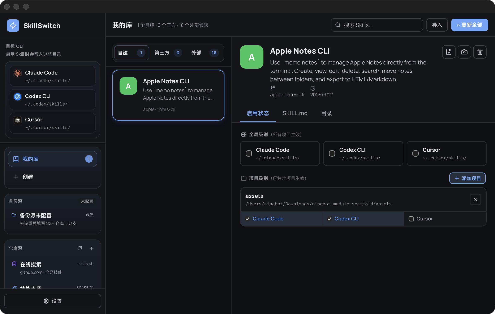

# SkillSwitch



**AI Skill 管理工具** — 专为 Claude Code、Codex CLI、Gemini CLI、Cursor、Windsurf 等 AI 编程助手设计的跨平台桌面应用，统一管理、发现、创建和备份你的 Skill 文件。

---

## 核心功能

### 📦 已安装管理

浏览和管理已安装的 Skills，支持：
- 版本信息、Stars、下载量统计
- 按全局/项目级别控制启用状态
- 查看 SKILL.md 入口文件

### 🔍 发现新 Skill

从仓库源浏览可安装 Skills，按分类筛选（Git & CI/CD、调试、安全、数据库、AI/LLM），一键安装/卸载。

### ✏️ 创建新 Skill

可视化编辑器创建 Skill，自动生成标准目录结构：
- `SKILL.md` — 入口文件
- `agents/` — 子 Agent 指令
- `assets/` — 静态资源
- `references/` — 参考文档
- `scripts/` — 可执行脚本

### 💾 备份与恢复

- 手动创建快照，随时回滚
- 卸载时自动保留，支持恢复
- SSH 推送到 GitHub 远程仓库

---

## 多 App 支持

侧边栏切换管理的 AI 应用：

| App | 标识色 |
|---|---|
| Claude Code | 🤖 橙色 |
| Codex CLI | ⌨️ 绿色 |
| Gemini CLI | 💎 蓝色 |
| Cursor | 🖱️ 紫色 |
| Windsurf | 🏄 青色 |

---

## 技术栈

| 层 | 技术 |
|---|---|
| 前端 | React 18 + TypeScript 5 + Vite 6 |
| 后端 | Tauri 2 (Rust) |
| 样式 | CSS Modules + CSS Variables |
| 包管理 | pnpm |

---

## 安装

从 [ Releases ](https://github.com/YOUR_USERNAME/skill-switch/releases) 下载对应平台安装包：

- **macOS** — `.dmg` 或 `.app`
- **Windows** — `.msi` 或 `.exe`
- **Linux** — `.deb` 或 `.AppImage`

---

## 常见问题

### macOS: "无法打开应用，因为无法验证开发者"

从 GitHub Releases 下载的应用未经过 Apple 签名，首次打开可能会被 macOS 阻止。解决方法：

```bash
xattr -d com.apple.quarantine /Applications/skill-switch.app
```

运行后即可正常打开应用。

---

## 开发

```bash
# 安装依赖
pnpm install

# 启动开发服务器
pnpm tauri dev

# 构建
pnpm tauri build
```

---

## 许可证

MIT License